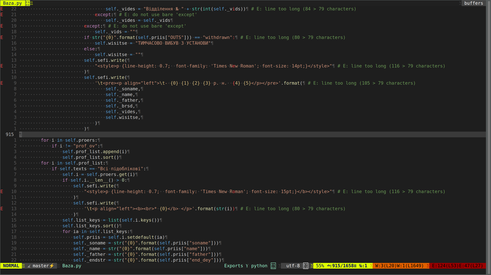

# 🐍 Python Development Environment Setup with Vim



A comprehensive setup script to transform your Vim into a powerful Python IDE with autocompletion, syntax checking, and modern development features.

## ✨ Features

- **🚀 Optimized Vim** with clipboard support and Python 3 integration
- **📦 Virtual Environment** setup with automatic package installation
- **⚡ Modern Plugins** for enhanced Python development
- **🎯 Syntax Highlighting** and code completion
- **🔧 Custom Vim Configuration** tailored for Python
- **📝 Pre-configured** with essential Python packages

## 🛠 Prerequisites

- Ubuntu 20.04 or higher
- Git installed
- sudo privileges

## ⚡ Quick Start

```bash
# Clone the repository
git clone git@github.com:Wendors/SetPyVim.git

# Navigate to the project directory
cd SetPyVim

# Make the script executable
chmod +x bash.sh

# Run the installation script
./bash.sh
