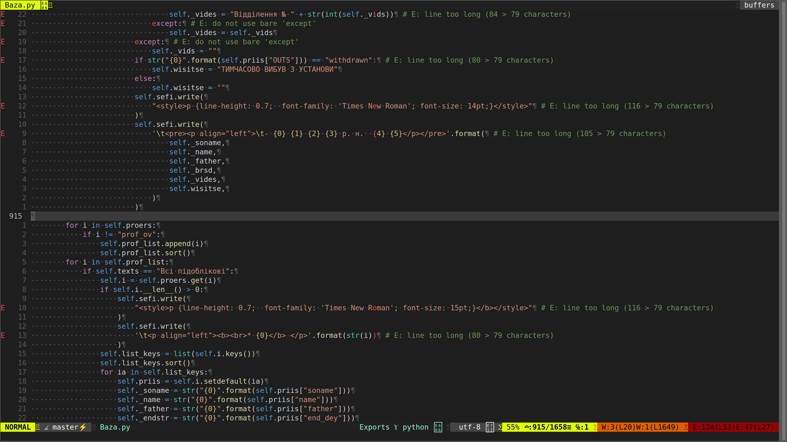

# 🐍 Python Development Environment Setup with Vim



A comprehensive setup script to transform your Vim into a powerful Python IDE with autocompletion, syntax checking, and modern development features. **Now with full Termux support for Android devices!**

## ✨ Features

- **🚀 Optimized Vim** with clipboard support and Python 3 integration
- **📦 Virtual Environment** setup with automatic package installation
- **⚡ Modern Plugins** for enhanced Python development
- **🎯 Syntax Highlighting** and code completion
- **🔧 Custom Vim Configuration** tailored for Python
- **📝 Pre-configured** with essential Python packages
- **📱 Termux Support** - Full Android mobile development environment

## 🛠 Prerequisites

### For Ubuntu/Debian:
- Ubuntu 20.04 or higher
- Git installed
- sudo privileges

### For Termux (Android):
- Termux app installed from F-Droid or GitHub
- Git installed (`pkg install git`)
- At least 500MB free storage

## ⚡ Quick Start

### Ubuntu/Debian Installation

```bash
# Clone the repository
git clone git@github.com:Wendors/SetPyVim.git

# Navigate to the project directory
cd SetPyVim

# Make the script executable
chmod +x bash.sh

# Run the installation script
./bash.sh
```

### Termux (Android) Installation

```bash
# Clone the repository
git clone https://github.com/Wendors/SetPyVim.git

# Navigate to the project directory
cd SetPyVim

# Make the script executable
chmod +x termux-setup.sh

# Run the installation script
./termux-setup.sh
```

## 📱 Termux Support

This repository now includes full support for **Termux** - a powerful terminal emulator for Android. You can now set up a complete Python development environment directly on your Android device!

### What's Different in Termux?

The `termux-setup.sh` script is specifically adapted for the Termux environment:

- ✅ **No sudo required** - Termux gives you direct package access
- ✅ **pkg package manager** - Uses Termux's package management system
- ✅ **Optimized for mobile** - Lighter weight configuration
- ✅ **No GUI dependencies** - Terminal-only setup for better compatibility
- ✅ **Storage optimized** - Carefully selected packages to minimize space usage

### Termux Installation Tips

1. **Storage Access**: Grant Termux storage permissions to access files:
   ```bash
   termux-setup-storage
   ```

2. **Keep Termux awake**: Acquire a wakelock to prevent interruptions during installation:
   ```bash
   termux-wake-lock
   ```

3. **After installation**: Remember to source your bashrc:
   ```bash
   source ~/.bashrc
   ```

4. **Performance**: For better performance on mobile, consider using NeoVim instead of Vim:
   ```bash
   nvim
   ```

### Limitations in Termux

- Some GUI-based Vim plugins won't work (GTK, X11)
- Clipboard integration may be limited
- Some packages requiring compilation might be slower or unavailable
- Memory-intensive operations may be slower on mobile devices
